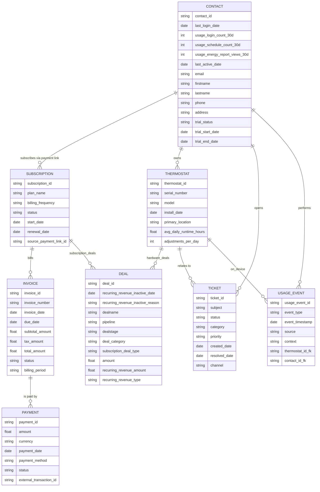

# HubSpot Integration Backend - Breezy Technical Assessment
# **A. Setup Instructions**

### Branch structure

All work for this technical assessment was completed on the branch:

`claude/setup-hubspot-contacts-api-01J9M7UsVoxBcGwVABm7SFAa`

This branch contains the full solution, including:
- frontend code
- backend code
- AI feature
- ERD and full data architecture
- final README

Please review and run the project from this branch.

## **1. Clone the Repository**
Clone the project and navigate into the folder:

```bash
git clone https://github.com/<your-username>/breezy-hubspot-sa-poc.git
cd breezy-hubspot-sa-poc
```

---

## **2. Install Dependencies**
Install the required Node.js packages:

```bash
npm install
```

This prepares the backend server and the frontend files served from `/public`.

---

## **3. Configure Environment Variables**
Create a `.env` file in the project root and add:

```
HUBSPOT_ACCESS_TOKEN=your_hubspot_private_app_token
OPENAI_API_KEY=your_openai_api_key
```

These are required for:

- Connecting to the HubSpot CRM API  
- Generating AI insights via OpenAI  

> Note: `.env` is excluded from version control for security.

### **HubSpot Private App Scopes**

The following scopes were enabled when creating the Legacy Private App.  
Not all scopes are used directly in the POC code, but they support the full ERD and future expansion (custom objects, line items, subscriptions):

- `crm.objects.companies.read`
- `crm.objects.companies.write`
- `crm.objects.contacts.read`
- `crm.objects.contacts.write`
- `crm.objects.custom.read`
- `crm.objects.custom.write`
- `crm.objects.deals.read`
- `crm.objects.deals.write`
- `crm.objects.line_items.read`
- `crm.objects.line_items.write`
- `crm.objects.subscriptions.read`
- `crm.objects.subscriptions.write`
- `crm.schemas.custom.read`
- `crm.schemas.custom.write`
- `crm.schemas.line_items.read`
- `crm.schemas.subscriptions.read`

These scopes provide full read and write access to the CRM objects represented in the ERD.  
The POC only interacts with Contacts, Deals and Subscriptions, but the additional scopes (such as custom objects and line items) reflect the wider architecture described in the data model.

---

## **4. Start the Application**
Start the Express server:

```bash
npm start
```

The application will be available at:

```
http://localhost:3001
```

This single server provides both the backend API and the frontend user interface.

---

## **5. Open the Frontend**
Visit:

```
http://localhost:3001
```

You will see the Breezy admin panel, which includes:

- Contact list  
- Create Contact form  
- Deals for the selected contact  
- Create Deal form  
- AI Insight panel  

---

## **6. HubSpot API Notes for Testing**

### **A. CRM Search API behaviour**
This POC explicitly requests the **50 most recent contacts** using the CRM Search API with a `limit` of 50 and sorting by `createdate DESC`. This keeps responses small and ensures newly created contacts appear at the top once indexed.

### **B. Indexing delay for newly created contacts**
HubSpot’s Search API does not index new contacts instantly. In testing, new contacts often took **several seconds** to become available in search results. This POC waits roughly **11 seconds** before refetching contacts to ensure consistent behaviour when demonstrating the create contact flow.

---

## **7. OpenAI Requirements**
To test the AI Insight feature:

- Ensure `OPENAI_API_KEY` is present in `.env`
- The server must have internet access  
- The `/api/ai/insight` endpoint will load automatically when a contact is selected

---
# **B. Project Overview**

This proof-of-concept demonstrates how **Breezy** could integrate their platform with HubSpot to unify customer data, track subscription conversions, and leverage AI for insights into conversion opportunities.

The POC includes:

- A lightweight **frontend admin panel** (served from `/public`) where Breezy’s team can:
  - View contacts stored in HubSpot  
  - Create new contacts (simulating a thermostat purchase + account creation)  
  - View deals for each contact (subscription conversions, upgrades)  
  - Create new deals associated with a contact  
  - View an **AI-powered insight card** for each contact  

- A Node/Express **backend server** that:
  - Proxies all requests to the HubSpot CRM API  
  - Performs secure contact and deal creation  
  - Fetches contact-associated deals  
  - Generates simulated usage data and calls OpenAI to produce AI insights  

- A full **HubSpot data model (ERD)** designed specifically for Breezy’s business:
  - Contact as the single source of truth  
  - Thermostat as a custom object  
  - Hardware deals vs. subscription deals  
  - Subscriptions, invoices, and payments  
  - Usage events and tickets  

The goal of this POC is to show how Breezy could use HubSpot as a unified customer system—connecting hardware purchases, subscription lifecycle events, usage-driven insights, and AI-powered next-best actions into a single place where marketing, sales and potentially customer success teams can act.

# **C. AI Usage Documentation**

### **AI model usage during development**

Two different AI models were used predominantly during the development of this proof of concept:

- **ChatGPT 5.1 (UI model):**  
  Used for planning, reasoning through design choices, validating the Recency, Frequency, Monetary concept for the AI feature and refining prompts before sending them to Claude Code.

- **Claude Code (Sonnet 4.5):**  
  Used in browser to generate and update frontend and backend files, implement API logic and build the AI endpoint based on the refined prompts.

I used AI throughout this assessment. The structure, architecture and approach all came from my own interpretation of Breezy’s business model and the assignment requirements. AI was used to accelerate specific tasks, validate thinking and help generate clean, testable code.

I used ChatGPT mainly for guidance at key points. Early on it helped clarify some practical setup tasks, such as getting the starter repository into VS Code, understanding how the backend was structured and confirming the correct workflow when Claude Code was committing changes directly to GitHub. I also used ChatGPT to help refine prompts before sending them to Claude Code. Rather than giving Claude one large instruction, I used ChatGPT to break the work into focused, assignment-aligned prompts covering contacts, deals, the admin layout and basic styling.

Claude Code handled most of the implementation work. It created the initial frontend structure, wrote the JavaScript for calling the backend API routes, and generated the UX for loading states, error handling and record creation. As I tested the app locally I identified issues, such as the shape of HubSpot’s Search API response or the delay before new contacts appear. I then wrote more targeted prompts to Claude to update the code where needed.

I also used AI when designing the optional AI feature. The underlying model was based on my own experience with B2C HubSpot customers where usage, recency, frequency, monetary value of purchase and multi product ownership tend to be the strongest predictors of conversion and retention. I suggested an RFM (Recency, Frequency, Monetary) style approach using signals such as trial timing, login activity, schedules created and energy report views, and ChatGPT helped validate and refine that thinking. It also helped me structure the system prompt for Claude Code so that the AI endpoint would return consistent JSON.
Claude then produced the backend endpoint that simulates usage metrics and sends them to OpenAI.

Finally, I used Zoom Whiteboard’s ‘Generate Mermaid with AI’ feature to create the ERD using a detailed prompt that I wrote myself.

A practical learning from this exercise is that not all AI tools are suited to all parts of the workflow. I initially explored Lovable for the frontend but quickly learned it is designed for purely frontend, serverless projects, and therefore did not fit this assignment which required integrating a pre existing Express backend.

# **D. HubSpot Data Architecture**


---

This section explains the data model designed for Breezy, why each object exists, how the associations work and how this structure supports Breezy’s hardware + SaaS business model. The design keeps the Contact as the single source of truth, with all other objects organised around it.

## **1. Core Object Model and Ownership**

### **1.1 Contact as the source of truth**

The Contact is the foundation of the entire architecture. It represents the customer or household and holds identity, trial status and the rolled up usage information that is required for onboarding and conversion. Every other object connects back to the Contact.

Trial details are stored directly on the Contact using properties such as:
- breezy_trial_status  
- breezy_trial_start_date  
- breezy_trial_end_date  
- breezy_last_login_date  
- breezy_last_usage_event  

Storing trial status on the Contact avoids creating a deal for every free trial and keeps trial tracking simple, scalable and aligned with how marketing teams want to enrol people into workflows.

### **1.2 Thermostat custom object**

Thermostats are represented as a custom object because hardware ownership is essential to Breezy’s business model. A Contact can have many Thermostats. This separates the individual from the device fleet and allows Breezy to track device level behaviour and support needs.

Example properties include:
- serial_number  
- model  
- installation_date  
- firmware_version  
- avg_daily_runtime  
- energy_savings_score  
- device_status  

Thermostats are associated with the Contact so Breezy can understand which devices belong to which household. Tickets and hardware deals link to Thermostats so device level issues and purchases can be tracked clearly. In the future Breezy could optionally associate Thermostats with Subscriptions if they ever move to a multiple subscription model.

---

## **2. Trial to Paid Subscription Lifecycle**

### **2.1 Free trial driven from hardware purchase**

A hardware purchase is the logical starting point for the Breezy Premium trial. When a thermostat is purchased, Breezy would create or update the Contact, create a Thermostat record and set the trial properties on the Contact. For example:
- breezy_trial_status = active  
- breezy_trial_start_date = purchase_date  
- breezy_trial_end_date = purchase_date + 30 days  

This ties the SaaS trial to the device lifecycle and avoids generating unnecessary deals for every trial.

### **2.2 No separate trial deal pipeline**

There were two possible approaches to modelling trials. The first was to create a separate trial pipeline with one deal (or other object) per trial. The second was to store trial status entirely on the Contact. I chose the second option. It avoids creating unnecessary deals / records, reduces CRM noise and works better with marketing automation because workflows can enrol based on simple property values rather than deal updates. It also avoids the complexity of updating the right deal later.

---

## **3. Payment Links, Subscription Creation and Email Flows**

### **3.1 Static payment links for monthly and annual upgrades**

For subscription upgrades the simplest and most scalable approach is to use two static payment links in HubSpot Payments. One link is for monthly billing and one is for annual billing. These can be added to onboarding emails during the early trial period and then to higher intent upgrade emails as the trial approaches expiry.

Quotes or per contact payment links were rejected because they are heavy for a B2C workflow, difficult to scale and unnecessary when a simple static link is sufficient.

Using the static payment links Breezy's marketing team can implement two CTAs or buttons in marketing emails to drive upgrades to paid subscriptions. Example copy - "Your free trial ends in 7 days - upgrade now to maintain access: Button 1 - Monthly @ $9.99 or Button 2 - Save 15% with an Annual Subscription!

### **3.2 Commerce behaviour and alternative options if HubSpot Payments is not used**

When a customer completes a HubSpot payment link, HubSpot automatically creates a Payment record and a Subscription record and associates them with the Contact based on email. Breezy should store payment methods for future charges meaning that at each billing date HubSpot will collect payment + create an invoice & receipt.

If Breezy did not want to use HubSpot Payments or Stripe they could continue using & linking out to an alternative payments product or a custom checkout page and then create the relevant HubSpot records through the CRM API. This could include creating a subscription deal and creating a custom subscription record (would need to be a custom object as the Subscription API only works with HubSpot Payments). This gives full control but requires Breezy to implement renewals, cancellations and upgrades manually. For this assessment the native Subscription object was used because it is simpler and integrates cleanly with workflows and Payments.

---

## **4. Deal Strategy and Recurring Revenue Reporting**

### **4.1 Hardware deals and subscription deals**

The model separates hardware revenue from subscription revenue. Hardware purchases produce Closed Won deals in a hardware pipeline and are associated with both the Contact and the relevant Thermostat. Subscription deals are created via a workflow when a Subscription is created and represent events such as initial conversion, upgrade or renewal. These deals sit in a separate subscription pipeline and make it easy to distinguish one off revenue from recurring revenue.

### **4.2 Recurring revenue fields on subscription deals**

Subscription deals make use of HubSpot’s recurring revenue framework. For example:
- recurring_revenue_deal_type is set to New business for the first subscription  
- recurring_revenue_amount stores the monthly equivalent revenue  
- recurring_revenue_type stores whether it is monthly or annual  

When subscriptions change state the workflow updates the inactive fields such as:
- recurring_revenue_inactive_date  
- recurring_revenue_inactive_reason  

A new deal is created for upgrades or renewals. This allows Breezy to use HubSpot’s recurring revenue analytics for accurate MRR and ARR reporting on monthly and annual subscriptions.

---

## **5. Workflows and Automation**

### **5.1 Subscription to deal workflow and why it is cleaner**

The Subscription object is the cleanest trigger for creating subscription deals because it represents the truth of what the customer has purchased. A workflow triggered on subscription creation sets the deal amount, the recurring revenue fields and the close date. When the Subscription later cancels or expires the workflow updates the inactive fields. This keeps the deal aligned with the Subscription without any risk of mismatching values.

Using Contact based triggers was avoided because updating the correct deal from a Contact workflow is difficult. Workflows operate on one primary object at a time and updating a specific deal requires association labels to identify which deal to change. This introduces complexity that is not needed when the Subscription object already provides a clear anchor.

---

## **6. Usage Data and AI Readiness**

### **6.1 Usage ingestion concept**

Although not fully implemented, the design anticipates a future state where Breezy’s SaaS platform periodically syncs usage signals such as:
- logins  
- schedule changes  
- energy report views  
- thermostat adjustments  
- feature adoption  

These map to Contact properties for high level automation and to Thermostat for device specific behaviour. This supports usage driven onboarding and win back campaigns and prepares Breezy for deeper AI driven insights. 

**For example Breezy’s marketing team could gamify onboarding by awarding users ‘climate impact points’ based on how often they use key features - celebrating milestones with messages like ‘You’ve reduced the equivalent of X lbs of carbon’ or ‘You just planted 3 virtual trees!’ This turns product adoption into a fun, meaningful progression tied to real environmental impact.**

### **6.2 AI feature**

The AI endpoint combines Contact details, the deals for that Contact and simulated usage metrics to produce:
- a conversion likelihood  
- an RFM style behavioural segment  
- reasoning  
- a next best action  

This output is then displayed in the frontend. It demonstrates how Breezy could use genuine usage data, subscription information and commercial history to power intelligent recommendations in the future.

### **6.3 Future idea: writing AI insight back into HubSpot**

A strong future enhancement would be to write the AI results back to the Contact as properties such as:
- breezy_ai_conversion_score  
- breezy_ai_next_best_action  

This would allow Breezy to use these insights for segmentation, automation and reporting inside HubSpot.

# **E. Deal Pipeline Architecture**

The deal architecture for Breezy reflects two clear revenue paths: hardware purchases and subscription signups. Hardware deals represent one off device purchases and sit in their own pipeline, while subscription deals represent events such as initial subscription conversion, upgrades and renewals and sit in a separate subscription pipeline. This separation keeps reporting clear and ensures hardware revenue never mixes with recurring SaaS revenue.

Each subscription deal is always derived from the Subscription record itself. A workflow listens for Subscription creation and creates a Closed Won subscription deal with the correct recurring revenue fields. Later lifecycle changes, such as cancellations or upgrades, trigger updates to the inactive recurring revenue fields or the creation of new deals for upgrades. This ensures Breezy can use HubSpot revenue analytics for accurate MRR and ARR reporting.

The deal pipelines are not used for trial tracking. Trial state lives directly on the Contact, which avoids unnecessary noise in the deals object or another custom object and allows workflows to enrol customers based on simple property changes rather than multiple deal updates. Hardware deals associate to both the Contact and the Thermostat, while subscription deals associate to the Contact and the Subscription. This creates a clean, predictable structure for both purchase journeys.

# **F. AI Feature Explanation**

The AI feature is designed to show how Breezy could use usage behaviour, trial timing and subscription context to predict conversion likelihood and identify the best next action for each customer. The logic is grounded in common subscription patterns where recent activity, frequency of engagement and device ownership have a strong relationship with whether a customer is likely to convert, upgrade or churn. From working with many B2C businesses in the past I know that that Recency, Frequency & Monetary value (generally all of purchase) are the key levers that an ecommerce business can pull to drive revenue growth. I have worked with HubSpot customers to set up workflows with triggers based on RFM in the past with some success, so I wanted to ideate an AI feature which could have similar impact.

In this case when a contact is selected in the interface the frontend calls a backend endpoint that gathers three sets of information. These are the contact details, the deals associated with that contact and a set of simulated usage metrics that represent logins, schedules created, energy report views and thermostat adjustments. The backend merges these three inputs into a structured payload and sends it to OpenAI using a system prompt that outlines Breezy’s business model, the trial to paid journey, the subscription lifecycle and an RFM style behavioural framing. I used contact demographics, deal data & usage as the metrics in this case since Breezy's SaaS B2C model differs from the standard ecommerce model where there are multiple products & opportunities to drive replenishment repurchase + upsell through add-ons.

The AI returns a JSON response containing four key elements. These are a conversion likelihood rating, an RFM style behavioural segment, a reasoning paragraph explaining the assessment and a recommended next best action. The usage metrics are also echoed back for transparency. The frontend presents this in a simple insight card that shows the likelihood badge, the segment label, the reasoning text and the suggested action, with an optional view of the usage signals.

This approach gives Breezy a clear example of how AI could support trial to paid conversion, upsell and retention. It combines behavioural signals, commercial history and trial timing to surface actionable insights in a marketer friendly format. In a production version the next step would be to write these AI outputs back to HubSpot as contact properties so they can drive segmentation, automation and reporting inside HubSpot.

# **G. Design Decisions**

This section highlights the key architectural decisions that shaped the proof of concept. Many details are covered in earlier sections, so the focus here is on the decisions that mattered most for producing a realistic and scalable integration pattern for Breezy.

## **1. Contact as the centre of the data model**

I kept the Contact as the single source of truth for identity, trial status and usage rollups. This avoids unnecessary trial deals and keeps lifecycle automation simple for marketing teams. It also fits Breezy’s B2C model where the household is the primary unit, not individual transactions.

## **2. Thermostat as a custom object**

A dedicated Thermostat object keeps hardware ownership separate from the person and supports multi device households. This gives Breezy a clear way to track both device level behaviour and device specific support issues.

## **3. Subscription driven workflow**

Using the Subscription as the trigger for subscription deals was a deliberate choice. It provides a reliable one to one relationship with a customer’s plan and avoids the complexity of trying to update the correct deal from a Contact workflow. It also aligns naturally with HubSpot Payments, which automatically creates the Payment and Subscription objects.

## **4. HubSpot Payments vs external checkout**

HubSpot Payments was used in this POC because it creates Subscription, Payment and Invoice records automatically. If Breezy preferred Stripe or a custom checkout process they could still link out to it and then use the CRM API to create subscription deals and a custom Subscription object, but this would require Breezy to manage renewals and cancellations themselves.

## **5. Separation of hardware and subscription revenue**

Hardware deals and subscription deals were kept in separate pipelines. This keeps reporting clean and allows Breezy to distinguish clearly between one off hardware revenue and recurring subscription revenue.

## **6. Handling real world behaviour of the HubSpot API**

I used the CRM Search API with sorting by createdate to surface newly created contacts quickly. I also accounted for the short indexing delay in HubSpot’s Search API and added the necessary handling so the UI behaves predictably.

## **7. Simulated usage for the AI feature**

Usage ingestion was out of scope, so I simulated usage signals in the backend. This still demonstrates how Breezy could combine trial timing, usage and deal history to generate meaningful AI insights and sets the stage for a future ingestion model.

# **H. Future Enhancements**

This proof of concept focuses on demonstrating the integration patterns rather than delivering a full production implementation. Below are the key areas that Breezy could develop further if this were taken beyond a POC.

## **1. Real usage ingestion**
In a full implementation Breezy would stream real usage events from their platform into HubSpot, rather than relying on simulated values. This would enable much more accurate onboarding journeys, churn prevention and AI driven next best actions.

## **2. Write AI insights back into HubSpot**
The AI feature currently displays insights in the UI only. A natural next step would be to write fields such as conversion likelihood or next best action back to the Contact, allowing Breezy to use these in lists, segmentation and workflows.

## **3. Subscription object refinement**
If Breezy chose not to use HubSpot Payments, they could introduce a custom Subscription object and manage renewals, cancellations and upgrades through their own billing system. This would keep HubSpot aligned with their payment provider while maintaining the same data structure.

## **4. Pagination and search in the frontend**
The POC intentionally limits contacts to the first fifty returned by HubSpot. A future version could include full pagination, free text search and filtering for a smoother admin experience.
