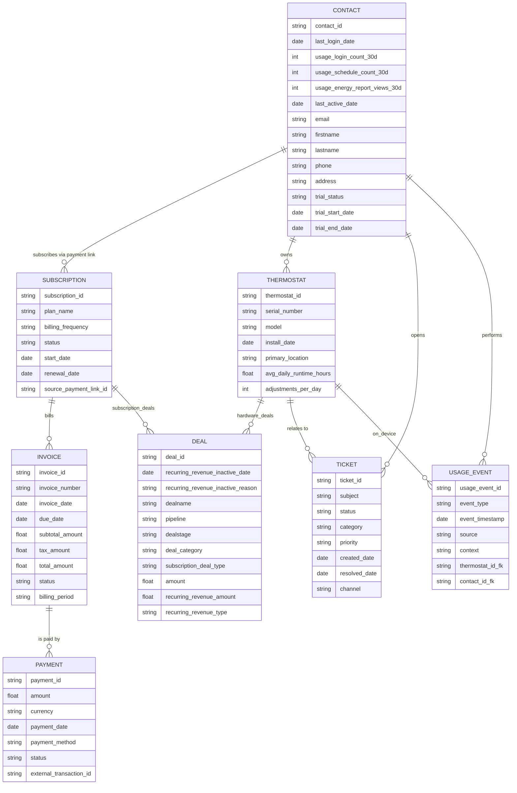

# HubSpot Integration Backend - Breezy Technical Assessment
# **A. Setup Instructions**

## **1. Clone the Repository**
Clone the project and navigate into the folder:

```bash
git clone https://github.com/<your-username>/breezy-hubspot-sa-poc.git
cd breezy-hubspot-sa-poc
```

---

## **2. Install Dependencies**
Install the required Node.js packages:

```bash
npm install
```

This prepares the backend server and the frontend files served from `/public`.

---

## **3. Configure Environment Variables**
Create a `.env` file in the project root and add:

```
HUBSPOT_ACCESS_TOKEN=your_hubspot_private_app_token
OPENAI_API_KEY=your_openai_api_key
```

These are required for:

- Connecting to the HubSpot CRM API  
- Generating AI insights via OpenAI  

> Note: `.env` is excluded from version control for security.

---

## **4. Start the Application**
Start the Express server:

```bash
npm start
```

The application will be available at:

```
http://localhost:3001
```

This single server provides both the backend API and the frontend user interface.

---

## **5. Open the Frontend**
Visit:

```
http://localhost:3001
```

You will see the Breezy admin panel, which includes:

- Contact list  
- Create Contact form  
- Deals for the selected contact  
- Create Deal form  
- AI Insight panel  

---

## **6. HubSpot API Notes for Testing**

### **A. HubSpot Search API delay (~11 seconds)**
New contacts created via the API may take **up to ~11 seconds** to appear in Search API results.  
The POC waits briefly before reloading and sorts by `createdate DESC` so new records appear at the top once indexed.

### **B. HubSpot Search limit (50 records)**
The CRM Search API returns **only the most recent 50 contacts** by default.  
Pagination was not required for this proof-of-concept.

---

## **7. OpenAI Requirements**
To test the AI Insight feature:

- Ensure `OPENAI_API_KEY` is present in `.env`
- The server must have internet access  
- The `/api/ai/insight` endpoint will load automatically when a contact is selected

---
# **B. Project Overview**

This proof-of-concept demonstrates how **Breezy**, a smart HVAC company, could integrate their platform with HubSpot to centralize customer data, track subscription conversions, and leverage AI for smarter lifecycle insights.

The POC includes:

- A lightweight **frontend admin panel** (served from `/public`) where Breezy’s team can:
  - View contacts stored in HubSpot  
  - Create new contacts (simulating a thermostat purchase + account creation)  
  - View deals for each contact (subscription conversions, upgrades)  
  - Create new deals associated with a contact  
  - View an **AI-powered insight card** for each contact  

- A Node/Express **backend server** that:
  - Proxies all requests to the HubSpot CRM API  
  - Performs secure contact and deal creation  
  - Fetches contact-associated deals  
  - Generates simulated usage data and calls OpenAI to produce AI insights  

- A full **HubSpot data model (ERD)** designed specifically for Breezy’s business:
  - Contact as the single source of truth  
  - Thermostat as a custom object  
  - Hardware deals vs. subscription deals  
  - Subscriptions, invoices, and payments  
  - Usage events and tickets  

The goal of this POC is to show how Breezy could use HubSpot as a unified customer system—connecting hardware purchases, subscription lifecycle events, usage-driven insights, and AI-powered next-best actions into a single place where marketing and success teams can act.

This is intentionally a simplified demonstration focused on integration patterns and architecture, rather than a production-ready application.

# **C. AI Usage Documentation**

I used AI throughout this assessment as a support, not as the decision maker. The structure, architecture and approach all came from my own interpretation of Breezy’s business model and the assignment requirements. AI was used to accelerate specific tasks, validate thinking and help generate clean, testable code.

I used ChatGPT mainly for guidance at key points. Early on it helped clarify some practical setup tasks, such as getting the starter repository into VS Code, understanding how the backend was structured and confirming the correct workflow when Claude Code was committing changes directly to GitHub. I also used ChatGPT to help refine prompts before sending them to Claude Code. Rather than giving Claude one large instruction, I used ChatGPT to break the work into focused, assignment-aligned prompts covering contacts, deals, the admin layout and basic styling.

Claude Code handled most of the implementation work. It created the initial frontend structure, wrote the JavaScript for calling the backend API routes, and generated the UX for loading states, error handling and record creation. As I tested the app locally I identified issues, such as the shape of HubSpot’s Search API response or the delay before new contacts appear. I then wrote more targeted prompts to Claude to update the code where needed.

I also used AI when designing the optional AI feature. The underlying model was based on my own experience with B2C HubSpot customers where usage behaviour, recency, frequency, monetary value and multi product ownership tend to be the strongest predictors of conversion and retention. I suggested an RFM (Recency, Frequency, Monetary) style approach using signals such as trial timing, login activity, schedules created and energy report views, and ChatGPT helped validate and refine that thinking. It also helped me structure the system prompt for Claude Code so that the AI endpoint would return consistent JSON.
Claude then produced the backend endpoint that simulates usage metrics and sends them to OpenAI.

Finally I used Zoom Whiteboard's generate Mermaid with AI option to create the ERD based on a detailed prompt I wrote myself.

A practical learning from this exercise is that not all AI tools are suited to all parts of the workflow. I initially explored Lovable for the frontend but quickly learned it is designed for purely frontend, serverless projects, and therefore did not fit this assignment which required integrating a pre existing Express backend.

# **D. HubSpot Data Architecture**


---

This section explains the data model designed for Breezy, why each object exists, how the associations work and how this structure supports Breezy’s hardware, SaaS and usage driven business. The design keeps the Contact as the single source of truth, with all other objects organised around it.

## **1. Core Object Model and Ownership**

### **1.1 Contact as the source of truth**

The Contact is the foundation of the entire architecture. It represents the customer or household and holds identity, trial status and the rolled up usage information that is required for onboarding and conversion. Every other object connects back to the Contact.

Trial details are stored directly on the Contact using properties such as:
- breezy_trial_status  
- breezy_trial_start_date  
- breezy_trial_end_date  
- breezy_last_login_date  
- breezy_last_usage_event  

Storing trial status on the Contact avoids creating a deal for every free trial and keeps trial tracking simple, scalable and aligned with how marketing teams want to enrol people into workflows.

### **1.2 Thermostat custom object**

Thermostats are represented as a custom object because hardware ownership is essential to Breezy’s business model. A Contact can have many Thermostats. This separates the individual from the device fleet and allows Breezy to track device level behaviour and support needs.

Example properties include:
- serial_number  
- model  
- installation_date  
- firmware_version  
- avg_daily_runtime  
- energy_savings_score  
- device_status  

Thermostats are associated with the Contact so Breezy can understand which devices belong to which household. Tickets and hardware deals link to Thermostats so device level issues and purchases can be tracked clearly. In the future Breezy could optionally associate Thermostats with Subscriptions if they ever move to a per device subscription model.

---

## **2. Trial to Paid Subscription Lifecycle**

### **2.1 Free trial driven from hardware purchase**

A hardware purchase is the logical starting point for the Breezy Premium trial. When a thermostat is purchased, Breezy would create or update the Contact, create a Thermostat record and set the trial properties on the Contact. For example:
- breezy_trial_status = active  
- breezy_trial_start_date = purchase_date  
- breezy_trial_end_date = purchase_date + 30 days  

This ties the SaaS trial to the device lifecycle and avoids generating unnecessary deals for every trial.

### **2.2 No separate trial deal pipeline**

There were two possible approaches to modelling trials. The first was to create a separate trial pipeline with one deal per trial. The second was to store trial status entirely on the Contact. I chose the second option. It avoids creating unnecessary deals, reduces CRM noise and works better with marketing automation because workflows can enrol based on simple property values rather than deal updates. It also avoids the complexity of updating the right deal later.

---

## **3. Payment Links, Subscription Creation and Email Flows**

### **3.1 Static payment links for monthly and annual upgrades**

For subscription upgrades the simplest and most scalable approach is to use two static payment links in HubSpot Payments. One link is for monthly billing and one is for annual billing. These can be added to onboarding emails during the early trial period and then to higher intent upgrade emails as the trial approaches expiry.

Quotes or per contact payment links were rejected because they are heavy for a B2C workflow, difficult to scale and unnecessary when a simple static link is sufficient.

### **3.2 Commerce behaviour and alternative options if HubSpot Payments is not used**

When a customer completes a HubSpot payment link, HubSpot automatically creates a Payment record and a Subscription record and associates them with the Contact based on email.

If Breezy did not want to use HubSpot Payments or Stripe they could continue using & linking out to a product like Stripe or a custom checkout page and then create the relevant HubSpot records through the CRM API. This could include creating a subscription deal and creating a custom subscription record (would need to be a custom object as the Subscription API only works with HubSpot Payments). This gives full control but requires Breezy to implement renewals, cancellations and upgrades manually. For this assessment the native Subscription object was used because it is simpler and integrates cleanly with workflows and Payments.

---

## **4. Deal Strategy and Recurring Revenue Reporting**

### **4.1 Hardware deals and subscription deals**

The model separates hardware revenue from subscription revenue. Hardware purchases produce Closed Won deals in a hardware pipeline and are associated with both the Contact and the relevant Thermostat. Subscription deals are created via a workflow when a Subscription is created and represent events such as initial conversion, upgrade or renewal. These deals sit in a separate subscription pipeline and make it easy to distinguish one off revenue from recurring revenue.

### **4.2 Recurring revenue fields on subscription deals**

Subscription deals make use of HubSpot’s recurring revenue framework. For example:
- recurring_revenue_deal_type is set to New business for the first subscription  
- recurring_revenue_amount stores the monthly equivalent revenue  
- recurring_revenue_type stores whether it is monthly or annual  

When subscriptions change state the workflow updates the inactive fields such as:
- recurring_revenue_inactive_date  
- recurring_revenue_inactive_reason  

A new deal is created for upgrades or renewals. This allows Breezy to use HubSpot’s recurring revenue analytics for accurate MRR and ARR reporting.

---

## **5. Workflows and Automation**

### **5.1 Subscription to deal workflow and why it is cleaner**

The Subscription object is the cleanest trigger for creating subscription deals because it represents the truth of what the customer has purchased. A workflow triggered on subscription creation sets the deal amount, the recurring revenue fields and the close date. When the Subscription later cancels or expires the workflow updates the inactive fields. This keeps the deal aligned with the Subscription without any risk of mismatching values.

Using Contact based triggers was avoided because updating the correct deal from a Contact workflow is difficult. Workflows operate on one primary object at a time and updating a specific deal requires association labels to identify which deal to change. This introduces complexity that is not needed when the Subscription object already provides a clear anchor.

---

## **6. Usage Data and AI Readiness**

### **6.1 Usage ingestion concept**

Although not fully implemented, the design anticipates a future state where Breezy’s SaaS platform periodically syncs usage signals such as:
- logins  
- schedule changes  
- energy report views  
- thermostat adjustments  
- feature adoption  

These map to Contact properties for high level automation and to Thermostat for device specific behaviour. This supports usage driven onboarding and win back campaigns and prepares Breezy for deeper AI driven insights.

### **6.2 AI feature**

The AI endpoint combines Contact details, the deals for that Contact and simulated usage metrics to produce:
- a conversion likelihood  
- an RFM style behavioural segment  
- reasoning  
- a next best action  

This output is then displayed in the frontend. It demonstrates how Breezy could use genuine usage data, subscription information and commercial history to power intelligent recommendations in the future.

### **6.3 Future idea: writing AI insight back into HubSpot**

A strong future enhancement would be to write the AI results back to the Contact as properties such as:
- breezy_ai_conversion_score  
- breezy_ai_next_best_action  

This would allow Breezy to use these insights for segmentation, automation and reporting inside HubSpot.

# **E. Deal Pipeline Architecture**

The deal architecture for Breezy reflects two clear revenue paths: hardware purchases and subscription events. Hardware deals represent one off device purchases and sit in their own pipeline, while subscription deals represent commercial events such as initial conversion, upgrades and renewals and sit in a separate subscription pipeline. This separation keeps reporting clear and ensures hardware revenue never mixes with recurring SaaS revenue.

Each subscription deal is always derived from the Subscription record itself. A workflow listens for Subscription creation and creates a Closed Won subscription deal with the correct recurring revenue fields. Later lifecycle changes, such as cancellations or upgrades, trigger updates to the inactive recurring revenue fields or the creation of new deals for upgrades. This ensures Breezy can use HubSpot revenue analytics for accurate MRR and ARR reporting.

The deal pipelines are not used for trial tracking. Trial state lives directly on the Contact, which avoids unnecessary noise in the deals object and allows workflows to enrol customers based on simple property changes rather than multiple deal updates. Hardware deals associate to both the Contact and the Thermostat, while subscription deals associate to the Contact and the Subscription. This creates a clean, predictable structure for both purchase journeys.
